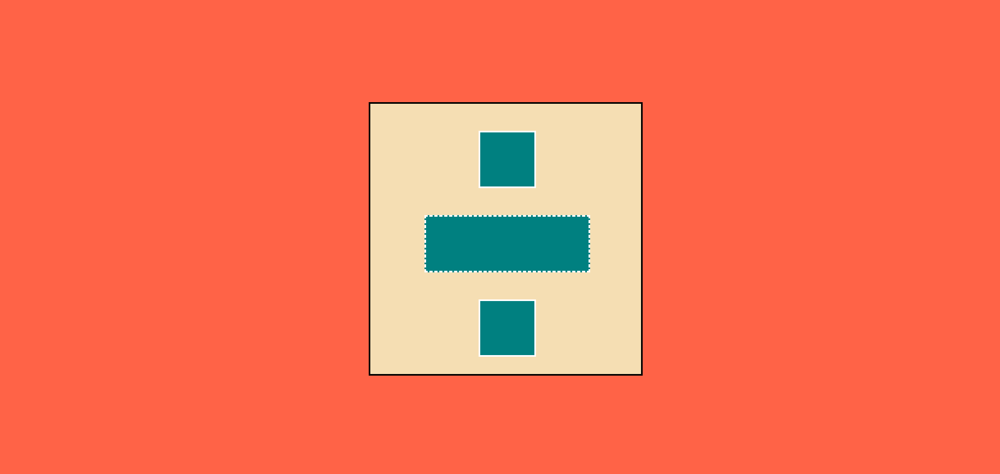
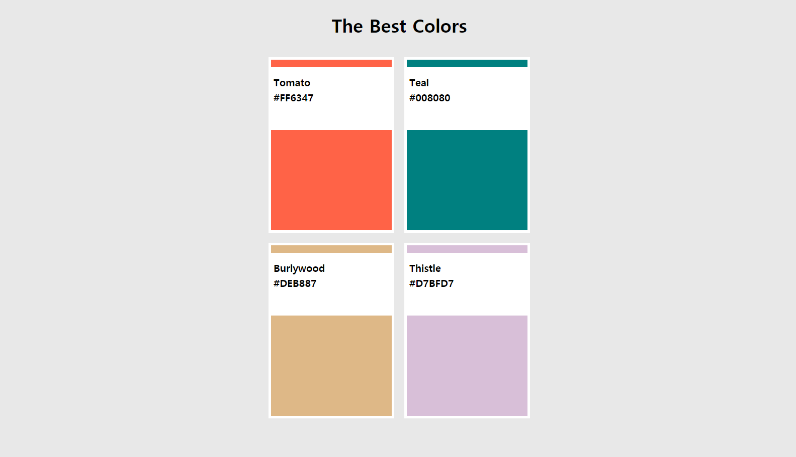
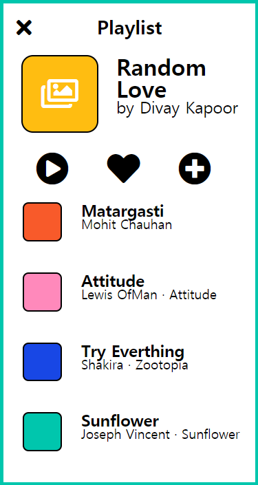

# Nomad_Kokoa_Challenge

## Day6: Basic Layout

## Day8: Let's use Pseudo Selector

## Day9: Add Animation

## Day10: Playlist Screen

## Day11: Make a Library App

## Day12: Make a Music App Screen
